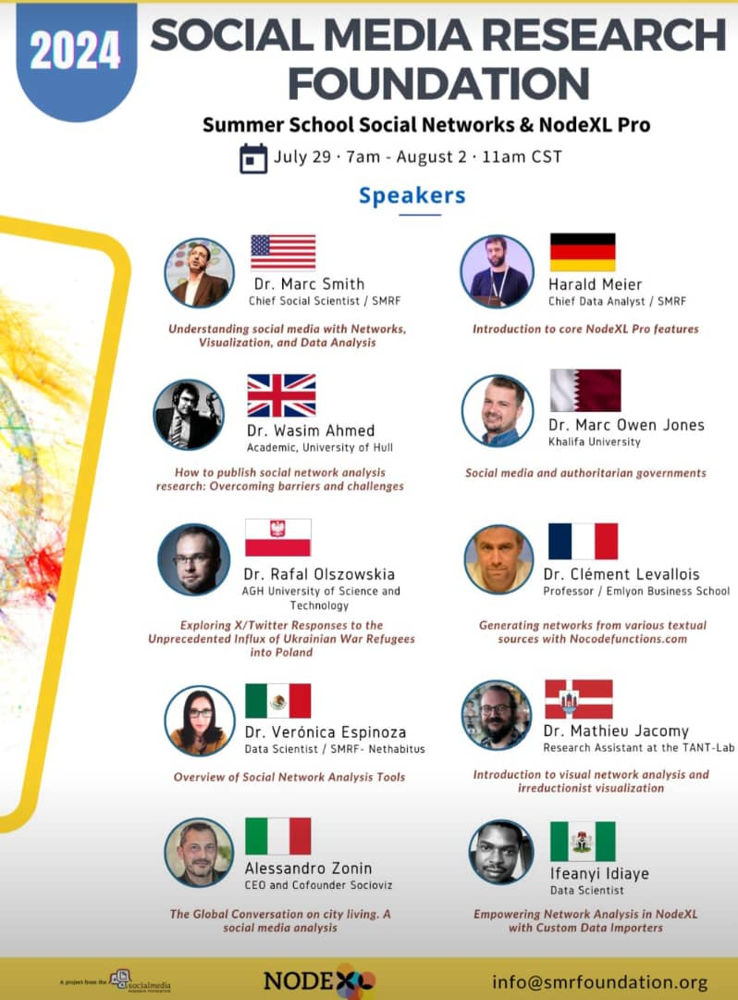
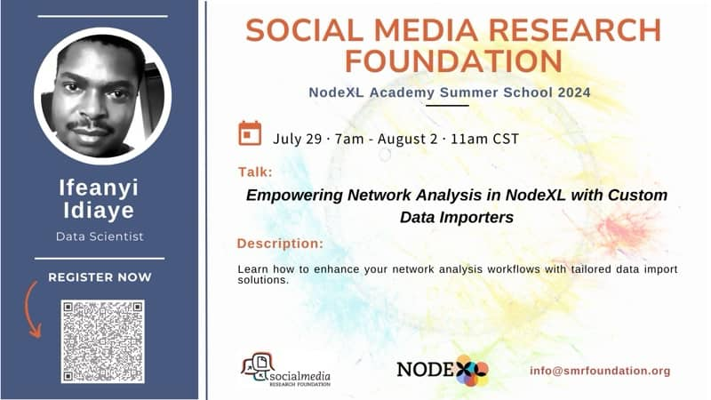
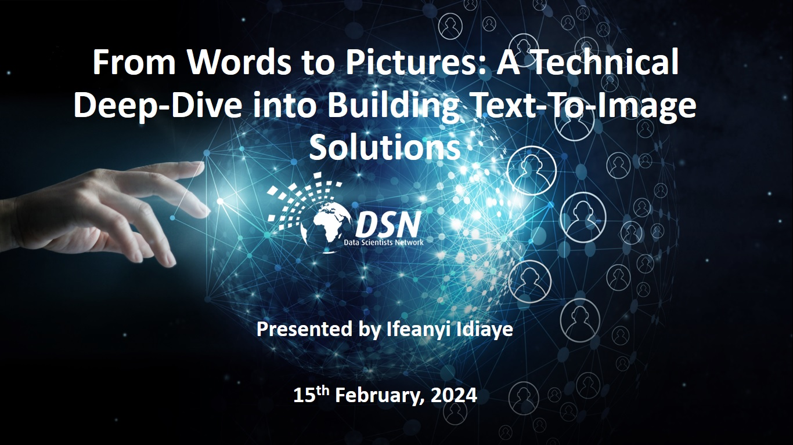
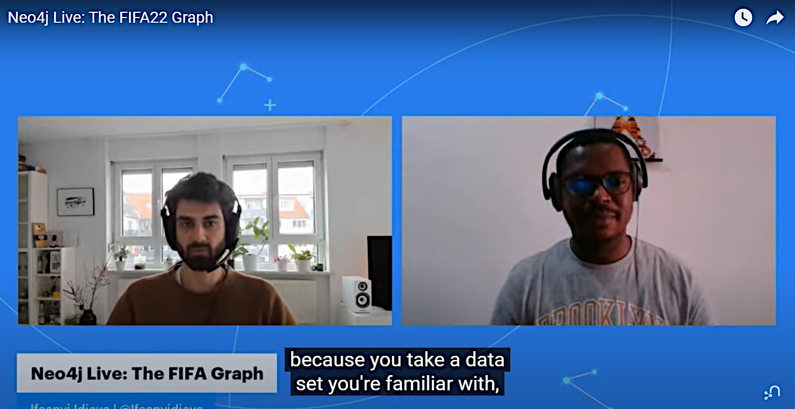

# **Ifeanyi Idiaye's Community CV**
## **Profile**
**Name**: Ifeanyichukwu Emeka Idiaye

**LinkedIn:** https://www.linkedin.com/in/ifeanyi-idiaye-09523abb/

**Twitter:** https://x.com/Ifeanyidiaye

**Medium:** https://medium.com/@ifeanyidiaye

**Email:** idiayeifeanyi@yahoo.com

**Country:** Nigeria

## Current Job Profile
**Company:** SocialDatabase [October 2020 - to date]

**Role:** Data Scientist

**About SocialDatabase:** 
SocialDatabase is is a pioneering platform that has revolutionised the digital marketing field by developing SUPERAUDIENCES – custom-built, highly targeted user groups crafted exclusively from public data sources through proprietary algorithms. Unlike traditional methods reliant on third-party data, SocialDatabase's transparent and privacy-focused approach ensures its clients reach receptive audiences, resulting in enhanced media spend efficiency, engagement relevance, and measurable business outcomes. By empowering businesses
to forge meaningful connections with our ideal consumers, SocialDatabase solidifies the clients' positions asindustry leaders, poised to capitalise on unprecedented growth opportunities.

**My Contributions at SocialDatabase:**
- Introduction of Google’s Text Rank algorithm for analysing and ranking tweets, reducing processing time by 65%, improving the speed of keyword-based tweet ranking by 3x, a crucial enhancement in influencer detection processes.
- Developed a remarkable Twitter monitoring application, accelerating data science workflow by 20% and introducing social monitoring. This innovation expanded SocialDatabase's toolkit, providing clients valuable insights into regional trends and audience sentiments.
- Improving the frontend design of SocialDatabase's audience insights dashboard by modifying the visualisation structure, colour scheme, and ggplot2 code. This iterative approach makes the dashboard more visually appealing, reactive, and user-friendly, enhancing data interpretation and aesthetic appeal.
- Optimizing the audience database, ensuring accurate geographical locations and implementing a ranking system based on follower count, improving data quality, client satisfaction, and trust in SocialDatabase's services, streamlining the database and providing more efficient insights.
- Writing R and Python scripts to collect publicly available data from Twitter (now X), using natural language processing methods to extract important information, such as keywords, key phrases, sentiments, and relevant entities, which are used for influencer detection and to enrich the company's database of influencer metadata.
- Developing and presenting interactive reports on the analysis of keyword queries on Twitter in web-hosted HTML documents and dashboards.
  
## **Application Motivation**
My primary motivation for applying to the Google Developer Expert (GDE) program is to use our unique platform as a programmer, data scientist and developer to collaborate, learn and create tools that improve workflows for a wide audience, especially non-technical users. . I believe technology should be accessible and my passion is creating solutions that bridge the gap between complex systems and everyday usability.

With an insatiable thirst for knowledge, I see the GDE program as a great opportunity to connect with industry leaders, gain valuable insights and hone my skills. I will have the opportunity to deepen my expertise in areas such as AI, machine learning and data-driven development while learning from Google's ecosystem of innovative technologies.

I am also very passionate about mentoring and sharing knowledge with the community, especially aspiring developers and data scientists. Through this program, I hope to help others better understand technology and use it more effectively. Through tutorials, lectures, hands-on collaboration, and more, I want to support others in reaching their potential.

Participating in the Google Developer Experts program not only allows me to grow, but it also allows me to give back by contributing to the development and success of others in the community.

## **Activities Outside of My Regular Work**
### **Open-Source Projects in collaboration with The Social Media Research Foundation**

I have an ongoing collaboration with [The Social Media Research Foundation](https://www.smrfoundation.org/) to build open-source data importers for their [NodeXL](https://nodexl.com/) social network analysis software. Together, we have built and deployed the following 2 software, which on average gets around 500 monthly active users, with several other open-source projects in the pipeline:
- [Spotify4NodeXL](https://spotify4nodexl.netlify.app/)
- [OpenAlex4NodeXL](https://openalex4nodexl.netlify.app/)

The Spotify4NodeXL project aims to allow users to query the Spotify API for related artists' data and collaboration data, which can then be loaded into NodeXL for network analysis. Given that Spotify is not inherently a social media platform, this project required significant creativity and ingenuity to extract meaningful network data from user behavior on Spotify. I handled the data engineering aspect of the project as well as its frontend.

The OpenAlex4NodeXL is designed to empower non-technical NodeXL users by enabling them to collect scientometric data from [OpenAlex](https://openalex.org/) in a format easily importable into NodeXL for visualization and scientific analysis. In addtion to the web application, the GitHub repository for this project also features a Jupyter notebook that users can run to fetch the necessary data effortlessly. As in the Spotify4NodeXL project above, I handled the data engineering and frontend of the web application.

In recognition of my contributions to these projects, The Foundation created a page for me on their website, which you can access [here](https://www.smrfoundation.org/staff-member/ifeanyi-idiaye/).

### **Open-Source Contributions to the Gephi community**

I built and deployed the [OpenAlex4Gephi](https://openalex4gephi.netlify.app/) to assist non-technical [Gephi](https://gephi.org/) users, majority of whom are researchers and social scientists, to easily collect scientometric data from OpenAlex.org and import it into Gephi for visualization and analysis. The project receives an average of 500+ active monthly users. The GitHub repository of the project has received **10 stars** so far, and you can access it [here](https://github.com/Ifeanyi55/OpenAlex4Gephi).

I created a GitHub repository of useful datasets and visualizations for learning and mastering Gephi for beginners. The objective of this repository is to help beginner users of Gephi readily find high-quality ready-to-load datasets that they can use in their Gephi learning. The repository has garnered **8 stars** so far, and you can access it [here](https://github.com/Ifeanyi55/GephiDatasets) 

### **Open-Source PDF to Word Converter**

I developed an open-source R package wrapper for the Python pdf2docx module, which enables R developers to easily convert their PDF files into Word with few lines of code. The package is called [Convert2Docx](https://github.com/Ifeanyi55/Convert2Docx), and it has received **10 stars** on GitHub.

### **Open-Source Spaces on Hugging Face**

I have created and deployed over [30 open-source spaces](https://huggingface.co/Ifeanyi) on Hugging Face. All the code that was used to build the applications running in these spaces are completely accessible to the general public, and anybody can raise an issue or submit a pull request on any of the public spaces.

### **Contribution to Python's Gradio Module**

As an ardent Python [Gradio](https://www.gradio.app/guides/quickstart) user, I was eager to demonstrate how to port the module into the R programming language. Therefore, I created a GitHub repository ([Gradio-in-R](https://github.com/Ifeanyi55/Gradio-in-R)) demonstrating how to install and use the module in R to create Gradio web frontend for R code. The project was shared with Gradio's discord community and it was well-received. 

I created and submitted a pull request to the official Gradio GitHub repository, which was merged by Gradio's maintainers. I also made a review and 11 commits on the repository. Gradio 5's documentation will incorporate my contribution when it is released.

## **Technical Writings**
### **Statistics Globe**

Between October 2022 and February 2024, I wrote over **200** articles on [Statistics Globe](https://statisticsglobe.com/about), bordering on programming concepts in R and Python, data visualization with Plotly, Seaborn, and Matploptlib, and generative AI. Here are some of my articles:

- [Check if Linked List is Empty in Python](https://statisticsglobe.com/check-linked-list-empty-python)
- [Check if List is Empty in Python](https://statisticsglobe.com/check-if-list-is-empty-python)
- [3D Plotly Graphs in R](https://statisticsglobe.com/3d-plotly-graph-r)
- [Change Plotly Axis Labels in R](https://statisticsglobe.com/change-plotly-axis-labels-r)
- [Text Summarization Using Hugging Face Transformers](https://statisticsglobe.com/text-summarization-hugging-face-transformers-python)

### **Medium & Dev Genius**

I am a regular writer on Medium and Dev Genius, writing mostly about data analytics, AI, and software. Here are some of my posts:

- [How to Deploy an RShiny App as a Hugging Face Space](https://ifeanyidiaye.medium.com/how-to-deploy-an-r-shiny-app-as-a-hugging-face-space-486532b0e58a)
- [How to use Gephi to Analyze Social Network Data for Beginners](https://ifeanyidiaye.medium.com/how-to-use-gephi-to-analyze-social-network-data-51d3ba0ef050)
- [Easily Build and Run Python Gradio Application inside the Browser with Gradio-Lite](https://ifeanyidiaye.medium.com/easily-build-run-python-gradio-applications-inside-the-browser-with-gradio-lite-a5b0df9bcf7c)
- [How to Build a Face Analyzer with DeepFace and Gradio](https://blog.devgenius.io/how-to-build-a-face-analyzer-with-deepface-gradio-5bfc49119ab9)
- [10 Python Dictionary Methods you should know](https://blog.devgenius.io/10-python-dictionary-methods-you-should-know-0b955c8247b3)
- [Fast Data Exploration in Python and R with Graphic-Walker](https://blog.devgenius.io/fast-data-exploration-in-python-r-with-graphic-walker-3174f1f8b727)

## **Public Speaking**
### **2024 NodeXL Summer School (July 29th - August 2nd)**

Attendees: 100+

I was one of 10 scheduled speakers at the 2024 NodeXL Summer School organized by The Social Media Research Foundation. It is a bi-annual event that holds every year. I spoke about and demonstrated 2 deployed open-source data importers we have collaborated on together. Here are the posters of the event:

Here is the link to the YouTube recording of my presentation: https://www.youtube.com/watch?v=knQD9KV2Eyk

### **Data Science Society of Nigeria (February 15th, 2024)**

Attendees: 100+

I was invited to do a technical deep-dive into text-to-image diffusion models along with a demo. At the end of the talk, I shared the links both to the slides I presented and to the GitHub repository hosting the code of the text-to-image generating software that I demonstrated during the session.

Here is the link to the GitHub repository:  [ImageGenerator](https://github.com/Ifeanyi55/ImageGenerator)

Here is the link to the slides that I presented: [Presentation slides](https://docs.google.com/presentation/d/1HpAGJJ4iZI2-TH_VmuQINqq1peYF-gCzN9g8MBnPoYI/edit?usp=sharing)

### **Neo4j YouTube Livestream (April 26th, 2022)**

Live viewers: 500+

I was invited as a guest to a YouTube livestream organized by Neo4j where I discussed an analytical project I worked on in which I utilized Neo4j graph analytics software to analyze the FIFA22 football dataset downloaded from Kaggle. The event was watched live by more than 500 viewers, and it continues to rack up more viewership till date.

Here is the link to the livestream: [FIFA22](https://www.youtube.com/watch?v=ZADwMoBJ6GQ&t=669s)

## **Volunteer Work**

### **Scottish Tech Army (August 2024)**

Since August 28th, 2024, I have been volunteering virtually with the [Scottish Tech Army](https://www.scottishtecharmy.org/). I have participated in virtual brainstorming meetings via Microsoft Teams, slack discussions, and project collaborations where I have been part of the conceptualization of a training program for workers on practical ways they can leverage AI technology to improve their workplace productivity. 

### **The Data Lab Scotland**

For over a year, I have been a very active member and contributor on [The Data Lab Scotland](https://thedatalab.com/)'s online community of data and AI professionals. I have consistently shared valuable knowledge, insights, projects, resources and fostered a collaborative and enriching environment for all. 

In recognition of these contributions, including welcoming new members to the community, I was given the honor to write an end-of-the-year reflection post for the year 2023, which was published on their website. You can read it [here](https://community.thedatalab.com/news/1799234)

## **Awards & Recognitions**

### **Data Visualization Contest**

I was one of three winners in the 2023 International Data Visualization contest organized by The Data Lab Scotland. My winning entry was an open-source analytical dashboard showing the collaborative efforts of mental health researchers to combat 3 critical mental health issues, namely depression, anxiety, and PTSD. You can take a look at the dashboard [here](https://research-effort-analytics.netlify.app/).

The award was announced at the 2023 Data Summit to over 500 AI and data professionals present at the summit. It was also reported in [FutureScot](https://futurescot.com/five-scottish-primary-schools-win-international-data-visualisation-competition/) with my name mentioned in the article.

This award makes me the first African and Nigerian to win this particular contest.

### **Gephi Top Contributor**

I have been awarded Top Contributor by the Gephi Facebook group in recognition of my contributions to the Gephi community of users, including the OpenAlex4Gephi software, GephiDataset GitHub repository, and knowledge and insights sharing. I have consistently, over the years, shared my Gephi projects and helpful resources with the community. I have answered questions and helped users stuck in their projects. 

### **Academic Mention**

I was mentioned in the 2022 PhD thesis of [Mathieu Jacomy](https://scholar.google.com/citations?user=m5CschQAAAAJ&hl=fr) as well as that of Sezon Simon in recognition of my contributions to graph data science with Gephi and programming. 

You can access Mathieu Jacomy's thesis [here](https://reticular.hypotheses.org/1879)

You can access Sezon Simon's thesis [here](https://researchportal.scu.edu.au/esploro/outputs/doctoral/Truth-Lies-and-Chiropractic/991013089413302368/filesAndLinks?index=0)

## **Projects Utilizing Google Technologies**

I have built a few projects in which I made use of technologies created by Google. However, in recent times, I have built projects that make use of Google's generative AI technology. Here are 3 of them:

- [PDF Summarizer](https://pdfsummarizer.netlify.app/): A PDF summarizing software that uses Google's Gemini 1.5 pro model for text summarization. It gets 300+ active monthly users.
- [Image Chat](https://ifeanyi-image-chat.hf.space/): A software that enables users to ask questions about images using Google's Gemini 1.5-flash model. It gets 600+ active monthly users.
- [Image-To-Story](https://ifeanyi-image-to-story.hf.space/): A software that enables users to generate stories from images using Google's Gemini 1.5-flash model. It gets 1000+ active monthly users.

